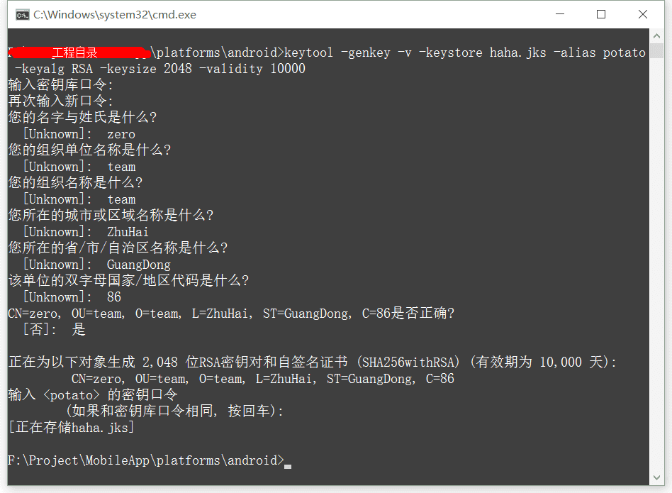

# Windows下Ionic2 app开发环境搭建

## Ionic简单介绍

首先，Ionic是什么。

Ionic是一款基于PhoneGap及Angular开发Hybrid/Web APP的前端框架，类似的其他框架有：Intel XDK等。
简单来说就是可以将你的Web应用打包发布成IOS/Android APP，并且提供了PhoneGap之外很多强大的服务和新的特性。
听起来还是很诱人的，事实上这也是目前最火的一中Hybrid APP开发方式。

接下来介绍如何在Windows下搭建Ionic开发环境。

在开始之前我假设你已经了解了如下概念。

- Java JDK 
- Apache Ant
- Android SDK
- NodeJS

**以上名词这里就不赘述，如果有不清楚的可以自行查阅**

## 安装步骤

Ionic官方教程：[http://learn.ionicframework.com/videos/windows-android/](http://learn.ionicframework.com/videos/windows-android/)

以下内容参考官方教程得出：

### 下载JDK并配置好Java运行环境

下载地址：[http://www.oracle.com/technetwork/java/javase/downloads/jdk8-downloads-2133151.html](http://www.oracle.com/technetwork/java/javase/downloads/jdk8-downloads-2133151.html)（请注意选择您电脑的对应版本）

Java环境变量的配置：参看：[http://zhidao.baidu.com/question/1366931535221381339.html](http://zhidao.baidu.com/question/1366931535221381339.html)

### 下载Apache Ant并将其bin目录路径添加进Path路径

下载地址：[http://mirror.tcpdiag.net/apache//ant/binaries/apache-ant-1.9.4-bin.zip](http://mirror.tcpdiag.net/apache//ant/binaries/apache-ant-1.9.4-bin.zip)

下载完成后解压该文件至某个安全的目录下，然后将改文件夹内的bin文件夹路径添加至系统Path环境变量中，如存放在C盘 Program Files目录下则Path中添加如下值 C:\Program Files\apache-ant-1.9.4\bin;（添加方法和java配置path变量是一样的，注意以;隔开每个环境变量的值）

### 下载Android SDK并配置好SDK运行环境

下载地址：[http://developer.android.com/sdk/index.html](http://developer.android.com/sdk/index.html)
 
这里可以只下载Android SDK不需要一并下载 Android Studio。

下载完成并安装然后向系统Path环境变量中添加两个值。分别是 Android SDK中tools目录的路径和platform-tools的路径。例如：

- C:\Program Files (x86)\Android\android-sdk\tools;
- C:\Program Files (x86)\Android\android-sdk\platform-tools;
        
在这里我发现Android SDK安装目录中并没有`platform-tools`这个文件夹，运行tools目录下的android.bat文件，然后在出现的界面中勾选Android SDK Platform-tools然后安装。

注意：这里我下载的纯净版SDK之前并没有任何Android系统在内，所以同·Platform-tools·一样需要在这里勾选需要的版本然后安装。这里至少需要有一个系统，否则无法创建虚拟机。当然，用真机调试的话可以不依赖。

### 下载NodeJS for Windows并安装

下载地址：[https://nodejs.org/download/](https://nodejs.org/download/)

Windows下安装NodeJS环境很简单，在NodeJS官网下载正确版本后安装即可。

### nmp安装Ionic和Cordova

完成以上几步需要配置的环境就搭建完成了，接下来就只需要在控制台输入简单的几行命令就可以安装Ionic和Cordova啦。

进入cmd窗口，输入如下指令：

`npm install -g cordova ionic`

**完成以上所有步骤，就可以开始愉快地利用Ionic快速开发Android APP啦**

## 创建并运行ionic app

### 创建APP 

在控制台输入

`ionic start myapp`

这里的 myapp是你的APP的名字

### 进入创建的APP目录

`cd myapp`

### 选择配置Android环境

`ionic platform add android`

### 打包生成APP

`ionic build android`

### 运行APP(需要先新建虚拟机/连接手机，新建方法：打开Android SDK安装目录下的AVD Manager.exe选择新建)

`ionic run android`

到这一步系统就会打开虚拟机运行简单的示例APP了。

## 其它

### --prod的作用

在编译命令的最后加上--prod会让app的启动速度加快。

`ionic build android --release --prod`

无论是debug版本还是release版本都适用。

### APP签名

#### 生成签名文件

生成签名文件需要用到keytool.exe (位于jdk1.6.0_24\jre\bin目录下)，使用产生的key对apk签名用到的是jarsigner.exe (位于jdk1.6.0_24\bin目录下)，把上两个软件所在的目录添加到环境变量path后，即可使用生成签名文件的命令：

```
keytool -genkey -v -keystore demo.jks -alias demo -keyalg RSA -keysize 2048 -validity 10000
```

- -genkey：产生密钥

- -keystore: 签名文件名称（这里是demo.jks，demo可以自定义，jks是Android studio生成的签名文件的后缀）

- -alias：签名文件的别名（这里是demo，demo可自定义）

- -keyalg：使用RSA算法对签名加密（默认RSA）

- -validity 有效期限（这里是10000天）

以上命令在cmd运行如下：



#### 自动签名

在工程目录/platforms/android目录新建名为release-signing.properties的文件，文件内容如下

	storeFile=demo.jks
	keyAlias=demo
	storePassword=输入的密钥库口令
	keyPassword=输入的密钥口令

这样，使用`ionic build android --release`编译即可，在/platforms/android/build/outputs/apk下就会生成已签名的安装包android-release.apk
   
在windows下storeFile文件路径应使用Unix下的目录分隔符/。

了解更多可进入Ionic官网： [http://ionicframework.com/](http://ionicframework.com/) 进行拓展阅读。
